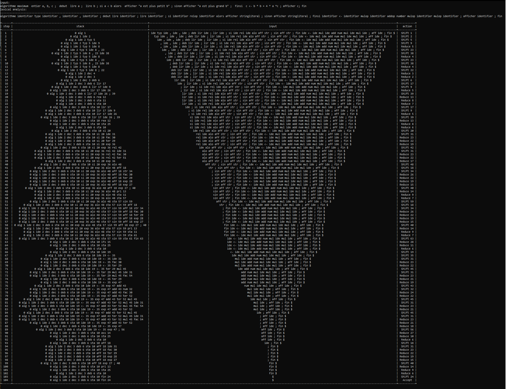

# SLR Compiler

This repository contains an implementation of a Simple LR (SLR) parser, designed to parse input based on a defined grammar and generate the corresponding parsing table and stack operations.

## Introduction

SLR parsers are essential in the **compilation process** of programming languages, ensuring that the code adheres to the syntactical rules of the language. When compiling, the source code is first broken down into tokens (via lexical analysis), and then the **SLR parser** checks if the sequence of tokens follows a set of predefined rules, called a **grammar**.

### What is a Grammar?

In the context of compilers, a **grammar** is a formal description of the syntax of a programming language. It defines the structure and allowable sequences of tokens (such as keywords, operators, and identifiers) that can form valid programs. Grammars are typically expressed in **Backus-Naur Form (BNF)** or **context-free grammar (CFG)**, specifying rules that describe how tokens can be combined to form valid language constructs like expressions, statements, and functions.

The SLR parser uses these grammar rules to construct a **parsing table**, which guides its decisions during parsing. The parser operates in a **shift-reduce** manner: it either shifts (reads the next token) or reduces (applies a grammar rule) based on the current state and the next input token.
Read more about it [here](https://en.wikipedia.org/wiki/LR_parser) .

In this [example](grammar.txt) we'll be using a grammar similar to that of [Pascal Programming Language](https://en.wikipedia.org/wiki/Pascal_(programming_language)) .

### Key Steps in SLR Parsing:

1. **Lexical Analysis**: The input code is tokenized using `analex.py`, breaking it down into fundamental components like keywords, operators, and identifiers.
2. **Grammar Definition**: The syntax of the language is formally defined by grammar rules in `grammar.txt`. These rules determine how tokens can be grouped into higher-level structures such as expressions and statements.
3. **SLR Parsing Table Generation**: Based on the grammar, the SLR parser constructs a table that helps it decide when to shift (read a token) or reduce (apply a grammar rule) while processing the token stream.
4. **Parsing Execution**: The parser uses the stack and the SLR table to process tokens and apply grammar rules, producing a syntactically valid structure from the input.
5. **Stack Operations**: The SLR parser maintains a stack to manage the state of parsing, using a shift-reduce algorithm to decide whether to move forward in the input or apply grammar rules.

### Example of SLR in Action:

The SLR parser ensures that programming constructs like loops, conditionals, or function calls are correctly formed according to the grammar of the language. If the input does not conform to the grammar, the parser will flag a syntax error, which helps in detecting incorrect code early in the compilation process.

---

## File Structure

- `analex.py`: Performs lexical analysis, converting input text into tokens.
- `grammar.txt`: Defines the grammar rules in a formal format for the parser.
- `grammar_config.py`: Configures and manages grammar options for parsing.
- `htmlparser.py`: Parses HTML Table  Data.
- `main.py`: The main entry point to run the SLR parser.
- `slr_table.html`: Example of SLR parsing table in an HTML format.
- `slrstack.py`: Implements the stack structure used during the parsing process.
- `example_execution.png`: Example of compiler output.

## Requirements

- Python 3.x
- External Libraries:
  - `beautifulsoup4`: For parsing HTML output.
    ```bash
    pip install beautifulsoup4
    ```

## Running the SLR Compiler

1. **Install Python 3.x**: Ensure Python 3.x is installed on your machine.
2. **Install Required Packages**: Install the `beautifulsoup4` package.
   ```bash
   pip install beautifulsoup4
   ```
3. **Define Grammar**: Modify the `grammar.txt` file to set your own grammar rules.
4. **Run the Compiler**:
   ```bash
   python main.py
   ```

## Example



---

## References
- **JSMachines LR(1) Table Generator:** The LR parsing table was generated using [this external tool](https://jsmachines.sourceforge.net/machines/lr1.html) to manage the complexity of table construction. Available at JSMachines LR(1) Table Generator.


